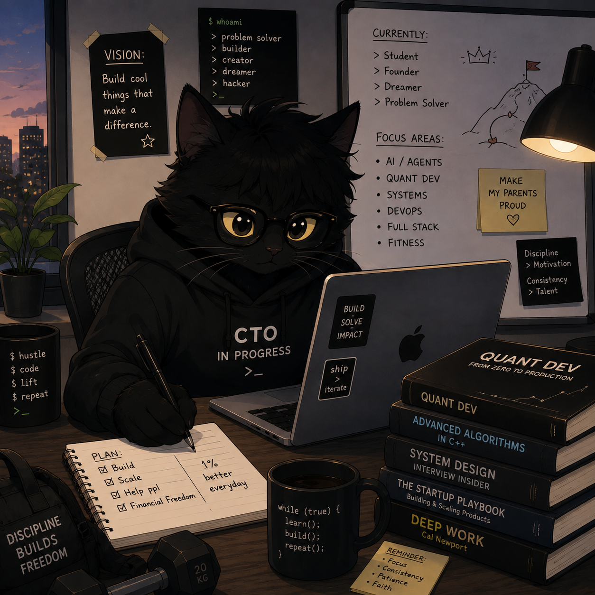

<div align="center">

# Hey, I'm [GeekyNads](https://geekynads.github.io/portfolio/) 👋


**Builder • Problem Solver • Founder • Dreamer**



`Student • Builder • Founder • Problem Solver • Hacker`

</div>

---
## One of my projects lets 🫵 u add this type of streak image add your own https://streak-line-three.vercel.app
<div align="center">
  


</div>

---

## `$ whoami`

I'm a student focused on **AI systems, quant dev, and full-stack engineering**.
I used to do everything with AI. Now I'm having second thoughts. 😶‍🌫️

```text
idea → code → product → reality
````


---

## Focus

* **AI / Agents**
* **Quant Dev**
* **Systems & DevOps**
* **Full Stack**
* **Algorithms & System Design**


---

## Connect

[Portfolio](https://geekynads.github.io/portfolio/) • [X](https://x.com/M_Likhit_Naidu)

---
<div align="center">
<h1>Sahi hai Tera.</h1>
</div>
</div>


